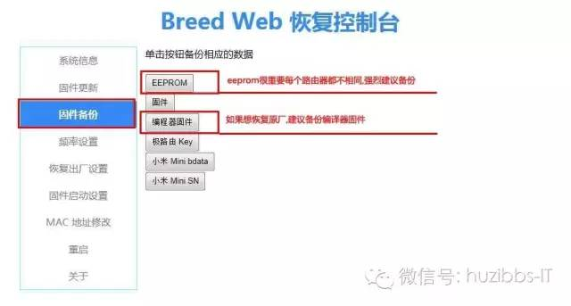
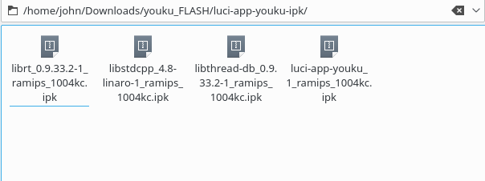
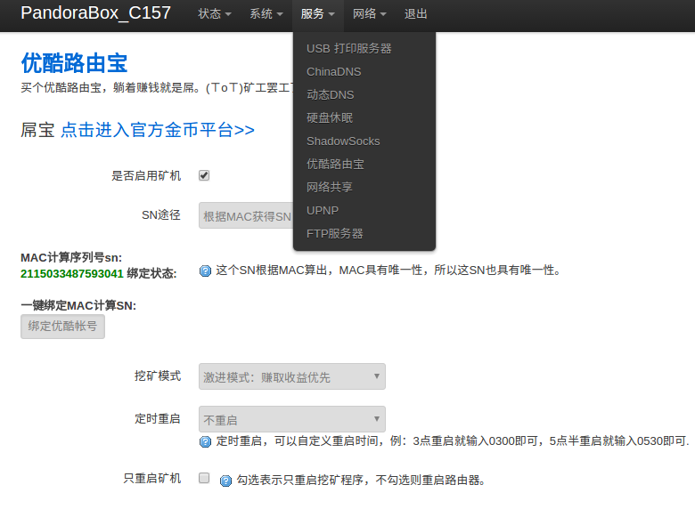

# 优酷路由刷机 记录

- 下载breed： <http://breed.hackpascal.net/> `http://breed.hackpascal.net/breed-mt7620-youku-yk1.bin` 最新

  - 如果路由器没有telnet，试着刷本目录下的`Youku-L1c-0818-root.bin` 文件或`YKL1_2.1.0613.8617_root_telnet.bin` 不行多试几次。

- 刷breed：

  - 将`breed-mt7620-youku-yk1 (1).bin` 想办法复制到路由器或着进入路由器直接`wget -c http://breed.hackpascal.net/breed-mt7620-youku-yk1.bin`
  - 然后：`mtd -r write /path/of/yours/u-boot-pandorabox-yk1-20150113.bin /dev/mtd1`

    - 如果不确定是不是 刷到 mtd1，`cat /proc/mtd`看哪个序号是Bootloader，上面的`/dev/mtd1 改成哪个` -

- breed ok后路由器断电，按住reset键，然后通电，看到四个灯都亮之后等几秒 松手，然后电脑端ip输入`192.168.1.1`看到breed web界面

- 下载 潘多拉固件：

  ```
  `http://downloads.openwrt.org.cn/PandoraBox/YouKu_YK1/firmware/testing/` 自行选择，或者用我目录下的`PandoraBox-ralink-mt7620-yk1-squashfs-sysupgrade-r1216-20150721.bin`
  ```

  - 刷入： 系统已经刷好了不想再进这个了，网络配图，选择 固件更新，将下载的固件选择，即可刷机成功

    ## 安装 优酷插件

把插件scp 到 优酷路由器：

- 举例： `scp john@192.168.1.177:/home/john/Downloads/youku_FLASH/youkuplugin/* /mnt/sda1/`

## 源配置末尾

```
arch all 100
arch ramips 200
arch ramips_24kec 300
arch ralink 400
```

然后 安装：`luci-app-youku-ipk`

opkg install *

- (四个包 )
- 
- 系统 -> 启动项 ：启用 `youku` 服务
- 重启： `reboot`
- 
- 完成

--------------------------------------------------------------------------------

所有资料包都在目录下

-- 有问题 可以 跟进issue 留言给我

--------------------------------------------------------------------------------

参考 ：<http://bbs.yj.youku.com/forum.php?mod=viewthread&tid=16671>
